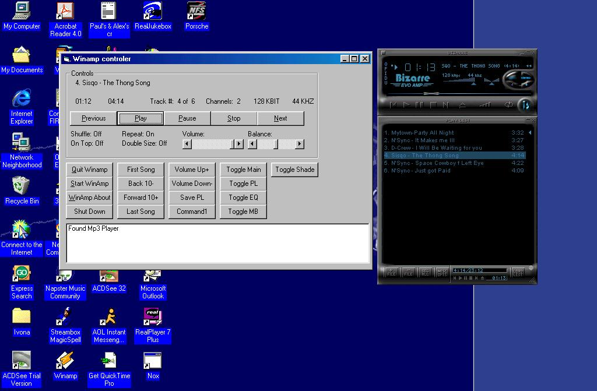



## Winamp Controler/Mp3

### Description

This Full Example Show how to control winamp. It also includes a Full Winamp Forntend .mod file which include all the function to control winamp.

I create this because i was making a Mp3 Player for the car and i need a winamp control and LCD Display to display songs.. and have cool function with the program

Have fun with it.
 
### More Info
 
The Forntend winamp Mod FIle

Must Have Winamp 2.0 or greater.

It return winamp functions

             |
---                |---
**Submitted On**   |2000-04-27 15:33:00
**By**             |[Pawel Pastuszak](https://github.com/Planet-Source-Code/PSCIndex/blob/master/ByAuthor/pawel-pastuszak.md)
**Level**          |Intermediate
**User Rating**    |5.0 (10 globes from 2 users)
**Compatibility**  |VB 5\.0, VB 6\.0
**Category**       |[Miscellaneous](https://github.com/Planet-Source-Code/PSCIndex/blob/master/ByCategory/miscellaneous__1-1.md)
**World**          |[Visual Basic](https://github.com/Planet-Source-Code/PSCIndex/blob/master/ByWorld/visual-basic.md)
**Archive File**   |[CODE\_UPLOAD52744272000\.zip](https://github.com/Planet-Source-Code/pawel-pastuszak-winamp-controler-mp3__1-7632/archive/master.zip)

